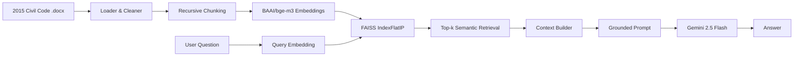

# Vietnamese Civil Law RAG


A Retrieval-Augmented Generation (RAG) project for question answering over the **Vietnamese Civil Code 2015**. The system retrieves relevant legal passages with dense embeddings and FAISS, then provides the retrieved context to Gemini to generate a grounded answer.

> **Note:** This is an educational AI project and is not a substitute for professional legal advice.

## Highlights

- End-to-end **RAG pipeline** from legal documents to grounded answers
- Dense Vietnamese legal retrieval with **BAAI/bge-m3** embeddings
- Exact vector search with **FAISS IndexFlatIP**
- Modular architecture separating preprocessing, retrieval, context, prompt and LLM layers
- Reproducible index building with generated FAISS artifacts excluded from version control

## Architecture



For a module-level explanation, see [`docs/architecture.md`](docs/architecture.md).

## Tech Stack

| Area | Technology |
|---|---|
| Language | Python |
| Embedding | BAAI/bge-m3 via FlagEmbedding |
| Vector Search | FAISS `IndexFlatIP` |
| LLM | Gemini 2.5 Flash |
| Document Processing | LangChain Community, LangChain Text Splitters, docx2txt |
| Utilities | NumPy, PyTorch, python-dotenv |

## Project Structure

```text
legal-nlp-rag/
├── context/          # Build context from retrieved passages
├── data/             # Source legal documents
├── docs/             # Architecture and evaluation documentation
├── llm/              # LLM abstraction and Gemini implementation
├── models/           # Embedding abstraction and BGE-M3 implementation
├── preprocess/       # Document loading, cleaning and chunking
├── prompt/           # Grounded legal QA prompt construction
├── retrieval/        # Query embedding and top-k retrieval
├── vectorstore/      # FAISS storage, search and persistence
├── build_index.py    # Build the vector index from source documents
├── chat.py           # Command-line RAG chatbot
├── main.py           # Application entry point
├── .env.example      # Environment-variable template
└── requirements.txt  # Python dependencies
```

## How It Works

1. `preprocess/loader.py` loads `.docx` files from `data/`.
2. `preprocess/cleaner.py` normalizes document text.
3. `preprocess/chunker.py` splits documents into overlapping chunks.
4. `models/bge_embedding.py` encodes chunks with `BAAI/bge-m3`.
5. `vectorstore/faiss_store.py` stores embeddings in a FAISS `IndexFlatIP` index.
6. At query time, `retrieval/retriever.py` embeds the user question and retrieves the top-k passages.
7. `context/context_builder.py` combines retrieved passages and source metadata.
8. `prompt/prompt_builder.py` instructs the LLM to answer only from the supplied context.
9. `llm/gemini_llm.py` generates the final response with Gemini 2.5 Flash.

## Setup

Clone the repository and create a virtual environment:

```bash
git clone https://github.com/tdk1522005/legal-nlp-rag.git
cd legal-nlp-rag
python -m venv .venv
```

Windows:

```bash
.venv\Scripts\activate
```

macOS/Linux:

```bash
source .venv/bin/activate
```

Install dependencies:

```bash
pip install -r requirements.txt
```

Configure Gemini by copying `.env.example` to `.env` and adding your API key:

```env
GEMINI_API_KEY=your_api_key_here
```

## Usage

Build the FAISS index:

```bash
python build_index.py
```

The generated index is stored under `index/` and is intentionally excluded from Git version control because it can be rebuilt from the source documents.

Start the chatbot:

```bash
python main.py
```

Type `exit` to stop the command-line chatbot.

## Retrieval Design

The current retriever uses **dense semantic search** with a BGE-M3 query embedding and FAISS `IndexFlatIP`. This keeps the retrieval pipeline simple and fully interpretable for learning purposes.

Current retrieval characteristics:

- dense embeddings
- exact inner-product search
- top-k passage retrieval
- no reranker
- no hybrid BM25 + dense retrieval yet

## Evaluation Status

Automated retrieval and answer-level evaluation are **not implemented yet**. A concrete evaluation roadmap is documented in [`docs/evaluation_plan.md`](docs/evaluation_plan.md), including planned metrics such as Hit@K, Recall@K and MRR.

## Current Limitations

- Retrieval currently uses dense top-k semantic search without a reranker.
- Evaluation is not yet automated with a dedicated legal QA benchmark.
- Answer quality depends on document coverage, chunking quality and retrieval quality.
- The current interface is command-line based.

## Roadmap

- Build a curated Vietnamese legal QA evaluation set.
- Add retrieval evaluation with Hit@K / Recall@K / MRR.
- Explore hybrid retrieval and reranking.
- Improve citation formatting for retrieved legal passages.
- Add automated tests and a web/API interface.

## Author

**Ta Duy Khanh**  
AI Engineering student — Machine Learning, Deep Learning & Natural Language Processing
