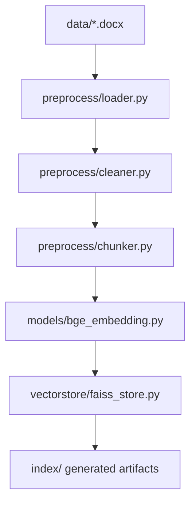
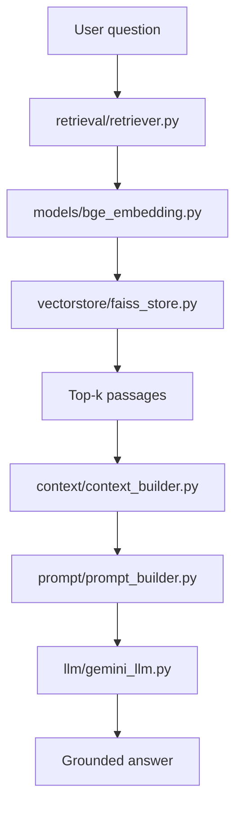

# Architecture

This document explains the current module boundaries and data flow of the Vietnamese Civil Law RAG project.

## Indexing flow

### Responsibilities

- `preprocess/loader.py`: loads legal documents from disk.
- `preprocess/cleaner.py`: normalizes the loaded text before chunking.
- `preprocess/chunker.py`: creates overlapping text chunks used as retrieval units.
- `models/bge_embedding.py`: converts legal text chunks into dense BGE-M3 vectors.
- `vectorstore/faiss_store.py`: stores vectors in FAISS and persists the generated index.
- `build_index.py`: orchestrates the indexing pipeline.

## Query flow

### Responsibilities

- `retrieval/retriever.py`: embeds the question and requests top-k semantic matches.
- `context/context_builder.py`: formats retrieved passages and their available source metadata.
- `prompt/prompt_builder.py`: constructs the grounded legal QA prompt.
- `llm/gemini_llm.py`: sends the prompt to Gemini and returns the generated answer.
- `chat.py`: handles the command-line conversation loop.
- `main.py`: starts the application.

## Design choices

### BGE-M3 embeddings

The current system uses `BAAI/bge-m3` to represent both document chunks and user questions in the same dense vector space.

### FAISS IndexFlatIP

`IndexFlatIP` performs exact inner-product search. This design is simple and useful for understanding the retrieval pipeline because there is no approximate-nearest-neighbor indexing layer hiding search behavior.

### Modular RAG components

Preprocessing, embeddings, retrieval, context building, prompt construction and generation are separated into modules so each stage can later be replaced or evaluated independently.

## Current scope

The repository currently implements dense semantic retrieval only. Hybrid retrieval, reranking, automated evaluation and a web/API layer are roadmap items rather than current features.
